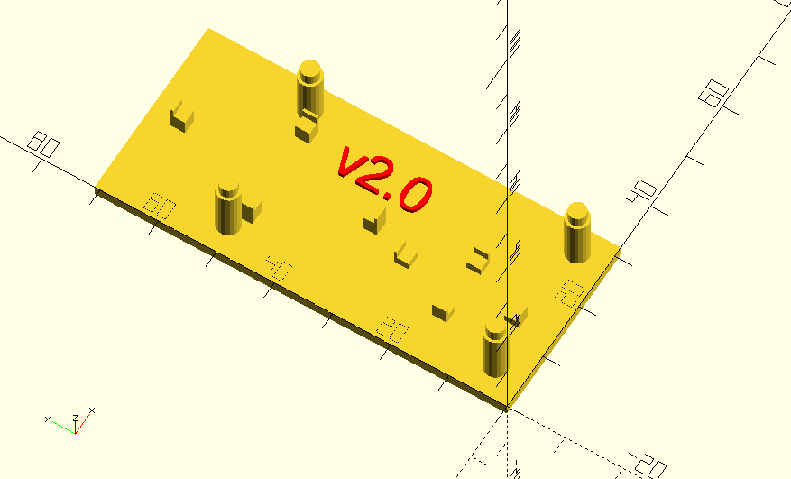
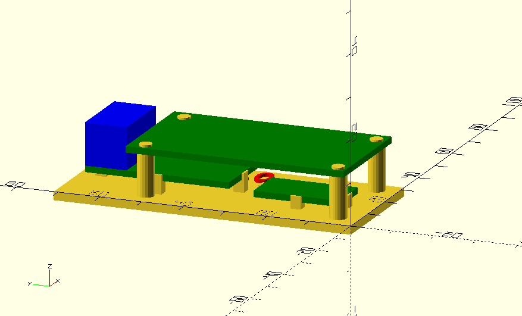

# Paw Sign Driver

Single channel PWD LED driver for ESPHome and HomeAssistant

## Contents

* `paw_enclosure.scad`: OpenSCAD 3D printer source code for enclosure
* `paw_enclosure.stl`: Rendered 3D printer model for enclosure
* `paw.yaml`: ESPHome project file

## Hardware

Input/Output: 12VDC
Target platform: ESP32

Pin Mapping:
|Pin 		|Function 		|
|- 			|- 				|
|GPIO13 	|Output Control |

## Enclosure / Assembly




## Software Setup

Setup ESPHome per
https://esphome.io/guides/getting_started_command_line

Provide a `secrets.yaml` file in the same directory as `paw.yaml` with the following contents:

```
ssid: 		# WiFi network name
wappw:		# WiFi password
hotspotpw:	# Create a password for the fallback ad-hoc network, if the device is unable to connect to wifi
apipw:		# Create a password for Homeassistant to use to connect to the device
```

## Compile / Run

```
esphome compile paw.yaml
esphome run paw.yaml
```

## Logs / Debug

```
esphome logs paw.yaml
```
